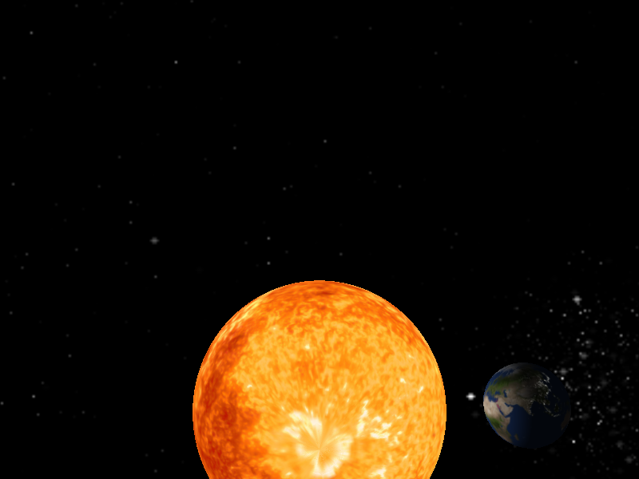

# Solar System OpenGL

A simple Sun–Earth simulation built with OpenGL 3.3 Core Profile, GLFW, GLAD, and GLM.
It demonstrates per-fragment Phong lighting with day/night texturing, specular oceans,
night-side city lights, an axially tilted rotating Earth, and a starfield skybox.



## Features

- Point-light Sun at the center with an orbiting, spinning Earth
- Day/night cycle with smooth twilight falloff and city lights on the night side
- 23.4° axial tilt, prograde rotation
- Free-fly camera (mouse look + zoom)
- Simulation controls: pause, freeze rotation/orbit independently, adjustable speed

## Requirements

- Windows with MinGW-w64 `g++` (e.g. [w64devkit](https://github.com/skeeto/w64devkit))
- GLFW 3.4, GLM, and GLAD (OpenGL 3.3 Core) headers and libraries reachable via
  the compiler's include/lib paths

## Build

Clone the repo, then build from the project folder:

```powershell
git clone https://github.com/boyaditya/grafikom-solar-system-opengl.git
cd grafikom-solar-system-opengl
```

With [w64devkit](https://github.com/skeeto/w64devkit) extracted to `C:\w64devkit`
(and `C:\w64devkit\bin` on `PATH`, plus GLFW 3.4, GLM, and GLAD installed there):

```powershell
g++.exe main.cpp C:\w64devkit\include\glad.c -o main.exe `
  -IC:\w64devkit\include -LC:\w64devkit\lib `
  -lglfw3 -lopengl32 -lgdi32
```

A VS Code build task (`.vscode/tasks.json`) with the same settings is included —
press `Ctrl+Shift+B`.

## Run

Run from the project folder, since shaders and textures are loaded via relative paths:

```powershell
.\main.exe
```

| Key | Action |
| --- | --- |
| W A S D + mouse + scroll | Move camera / look around / zoom |
| SPACE | Pause / resume |
| R / O | Freeze rotation / orbit |
| Up / Down | Simulation speed |
| ESC | Quit |

## Layout

```
main.cpp                  main loop, orbit, rotation, camera, input
Sphere.h                  Earth sphere mesh (positions, UVs, normals)
Sphere_light.h            Sun sphere mesh (unlit)
shader_m.h / camera.h     GLSL loader / FPS camera
shaders/object.vs / object_emission.fs   Earth shader
shaders/light_source.vs / .fs    Sun shader
shaders/skybox.vs / .fs          Skybox shader
resources/                planet textures, starfield cubemap
```
